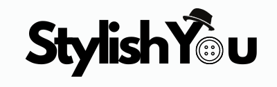

<div align="center">
  
<h1 align="center">
    
</h1>
  
  

  <h1>StylishYou : Your Fashion Journey Starts Here</h1>
  
  <p>
    Welcome to StylishYou, your ultimate destination showcasing a diverse array of clothing categories from the most popular brands in fashion.
  </p>
  
  
<!-- Badges -->
<p>
  <a href="https://github.com/Raouf-Braham/StylishYou//graphs/contributors">
    
  </a>
  <a href="">
    
  </a>
  <a href="https://github.com/Raouf-Braham/StylishYou/network/members">
    
  </a>
  <a href="https://github.com/Raouf-Braham/StylishYou">
    
  </a>
  <a href="https://github.com/Raouf-Braham/StylishYou/issues/">
    
  </a>
  <a href="https://github.com/Raouf-Braham/StylishYou/blob/master/LICENSE">
    
  </a>
</p>
   
<h4>
    <a href="http://stylishyou.onlinewebshop.net/Loading%20Page/">View Demo</a>
  <span> · </span>
    <a href="https://github.com/Raouf-Braham/StylishYou">Documentation</a>
  <span> · </span>
    <a href="https://github.com/Raouf-Braham/StylishYou/issues/">Report Bug</a>
  <span> · </span>
    <a href="https://github.com/Raouf-Braham/StylishYou/issues/">Request Feature</a>
  </h4>
</div>

<br />

<!-- Table of Contents -->
# Table of Contents

- [About the Project](#about-the-project)
  * [Mission](#mission)
  * [Tutorial](#tutorial)
  * [Tech Stack](#tech-stack)
  * [Features](#features)
  * [Color Reference](#color-reference)
  * [Environment Variables](#environment-variables)
- [Getting Started](#getting-started)
  * [Prerequisites](#prerequisites)
  * [Installation](#installation)
  * [Running Tests](#running-tests)
  * [Run Locally](#run-locally)
  * [Deployment](#deployment)
- [Usage](#usage)
- [Roadmap](#roadmap)
- [Contributing](#contributing)
  * [Code of Conduct](#code-of-conduct)
- [FAQ](#faq)
- [License](#license)
- [Contact](#contact)
- [Acknowledgements](#acknowledgements)
  

<!-- About the Project -->
## About the Project

<!-- Mission -->
### Mission
StylishYou aims to address the complexity and fragmentation of online shopping for a variety of branded clothing, providing a seamless user experience. We offer a comprehensive range of products including clothing, shoes, accessories, and cosmetics for all genders and ages. Our goal is to ensure a secure and enjoyable shopping experience while showcasing international brand collections attractively. Additionally, we have implemented a user management system with registration and login features, as well as an admin dashboard for managing products and orders.

<!-- Tutorial -->
### Tutorial

<p>This concise tutorial demonstrates the process of seamlessly adding and removing products from your cart, progressing to the checkout page, and specifying desired quantities for ordering.</p>
<br>
<p>You may access the platform by either creating a personal account or utilizing the provided user credentials:</p>
<p>Username: user@gmail.com | Password: user2024</p>

https://github.com/Raouf-Braham/StylishYou/assets/146178733/0ae6c69b-227c-475e-9309-7e8d96b3f3ab


<!-- TechStack -->
### Tech Stack

<details>
  <summary>Client</summary>
  <ul>
    <li><a href="https://www.typescriptlang.org/">Typescript</a></li>
    <li><a href="https://nextjs.org/">Next.js</a></li>
    <li><a href="https://reactjs.org/">React.js</a></li>
    <li><a href="https://tailwindcss.com/">TailwindCSS</a></li>
  </ul>
</details>

<details>
  <summary>Server</summary>
  <ul>
    <li><a href="https://www.typescriptlang.org/">Typescript</a></li>
    <li><a href="https://expressjs.com/">Express.js</a></li>
    <li><a href="https://go.dev/">Golang</a></li>
    <li><a href="https://nestjs.com/">Nest.js</a></li>
    <li><a href="https://socket.io/">SocketIO</a></li>
    <li><a href="https://www.prisma.io/">Prisma</a></li>    
    <li><a href="https://www.apollographql.com/">Apollo</a></li>
    <li><a href="https://graphql.org/">GraphQL</a></li>
  </ul>
</details>

<details>
<summary>Database</summary>
  <ul>
    <li><a href="https://www.mysql.com/">MySQL</a></li>
    <li><a href="https://www.postgresql.org/">PostgreSQL</a></li>
    <li><a href="https://redis.io/">Redis</a></li>
    <li><a href="https://neo4j.com/">Neo4j</a></li>
    <li><a href="https://www.mongodb.com/">MongoDB</a></li>
  </ul>
</details>

<details>
<summary>DevOps</summary>
  <ul>
    <li><a href="https://www.docker.com/">Docker</a></li>
    <li><a href="https://www.jenkins.io/">Jenkins</a></li>
    <li><a href="https://circleci.com/">CircleCLI</a></li>
  </ul>
</details>

<!-- Features -->
### Features

- Feature 1
- Feature 2
- Feature 3

<!-- Color Reference -->
### Color Reference

| Color             | Hex                                                                |
| ----------------- | ------------------------------------------------------------------ |
| Primary Color |  #222831 |
| Secondary Color |  #393E46 |
| Accent Color |  #00ADB5 |
| Text Color |  #EEEEEE |


<!-- Env Variables -->
### Environment Variables

To run this project, you will need to add the following environment variables to your .env file

`API_KEY`

`ANOTHER_API_KEY`

<!-- Getting Started -->
## Getting Started

<!-- Prerequisites -->
### Prerequisites

This project uses Yarn as package manager

```bash
 npm install --global yarn
```

<!-- Installation -->
### Installation

Install my-project with npm

```bash
  yarn install my-project
  cd my-project
```
   
<!-- Running Tests -->
### Running Tests

To run tests, run the following command

```bash
  yarn test test
```

<!-- Run Locally -->
### Run Locally

Clone the project

```bash
  git clone https://github.com/Louis3797/awesome-readme-template.git
```

Go to the project directory

```bash
  cd my-project
```

Install dependencies

```bash
  yarn install
```

Start the server

```bash
  yarn start
```


<!-- Deployment -->
### Deployment

To deploy this project run

```bash
  yarn deploy
```


<!-- Usage -->
## Usage

Use this space to tell a little more about your project and how it can be used. Show additional screenshots, code samples, demos or link to other resources.


```javascript
import Component from 'my-project'

function App() {
  return <Component />
}
```

<!-- Roadmap -->
## Roadmap

* [x] Todo 1
* [ ] Todo 2


<!-- Contributing -->
## Contributing

<a href="https://github.com/Louis3797/awesome-readme-template/graphs/contributors">
  
</a>


Contributions are always welcome!

See `contributing.md` for ways to get started.


<!-- Code of Conduct -->
### Code of Conduct

Please read the [Code of Conduct](https://github.com/Louis3797/awesome-readme-template/blob/master/CODE_OF_CONDUCT.md)

<!-- FAQ -->
## FAQ

- Question 1

  + Answer 1

- Question 2

  + Answer 2


<!-- License -->
## License

Distributed under the no License. See LICENSE.txt for more information.


<!-- Contact -->
## Contact

Your Name - [@twitter_handle](https://twitter.com/twitter_handle) - email@email_client.com

Project Link: [https://github.com/Louis3797/awesome-readme-template](https://github.com/Louis3797/awesome-readme-template)


<!-- Acknowledgments -->
## Acknowledgements

Use this section to mention useful resources and libraries that you have used in your projects.

 - [Shields.io](https://shields.io/)
 - [Awesome README](https://github.com/matiassingers/awesome-readme)
 - [Emoji Cheat Sheet](https://github.com/ikatyang/emoji-cheat-sheet/blob/master/README.md#travel--places)
 - [Readme Template](https://github.com/othneildrew/Best-README-Template)
